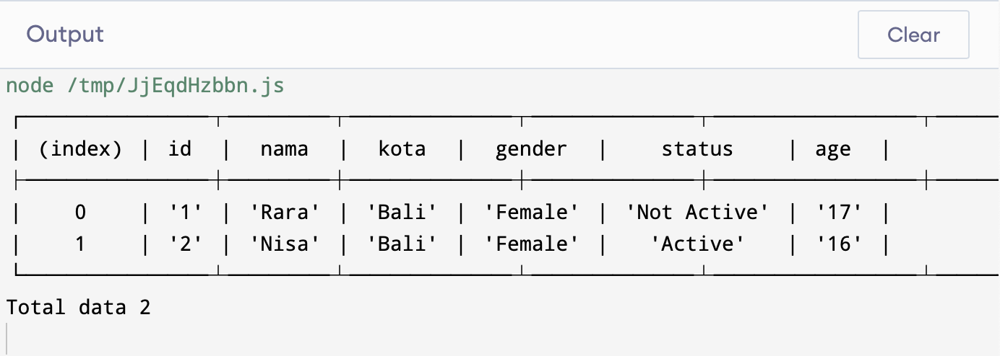

# JS Itern Test

```javascript
const data = [
    "1_Rara_Bali_2_0_17",
    "2_Nisa_Bali_2_1_16"
]
```

`1_Rara_Bali_2_0_17` \
`<id>_<name>_<city>_<gender>_<status>_<age>`

- id: user id
- name: user name
- city: user city
- gender: user gender, male or female
  - 1 male
  - 2 female
- status: user status active or not active
  - 0 Not Active
  - 1 Active

## Expected Result


